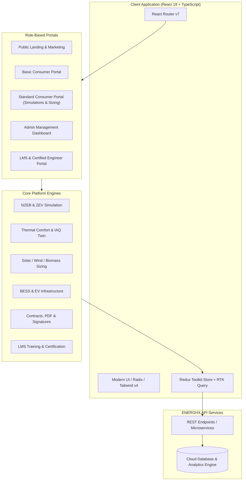

# ⚡ ENERGHX™ | Clean-Tech & Net-Zero Energy Management Platform

<div align="center">


**An enterprise-grade clean-tech web platform for thermal comfort modeling, indoor air quality simulation, renewable energy microgrid sizing, and net-zero energy management.**

[](https://energhx.vercel.app/)
[](https://react.dev/)
[](https://www.typescriptlang.org/)
[](https://vitejs.dev/)
[](https://tailwindcss.com/)
[](https://redux-toolkit.js.org/)
[](#)

[🌐 Live Application](https://energhx.vercel.app/) •
[🔑 Demo Credentials](#-live-demo--credentials) •
[Overview](#-overview) •
[Visual Showcase](#-visual-showcase) •
[Key Features](#-key-features) •
[Tech Stack](#-tech-stack) •
[System Architecture](#-system-architecture) •
[Project Structure](#-project-structure) •
[Getting Started](#-getting-started) •
[Portfolio Metadata](#-portfolio-client-project-data)

</div>

---

## 🌐 Live Demo & Credentials

The application is deployed and accessible at:
- **Live URL**: [https://energhx.vercel.app/](https://energhx.vercel.app/)
- **Repository**: [https://github.com/Ramjanict/ENERGHX-](https://github.com/Ramjanict/ENERGHX-)

### 🔑 Demo Super Admin Credentials
To access the full management portal, analytics dashboard, course assignments, and system approvals:

| Parameter | Value |
| :--- | :--- |
| **Portal URL** | [https://energhx.vercel.app/login](https://energhx.vercel.app/login) |
| **Role** | **Super Admin** |
| **Email** | `super@email.com` |
| **Password** | `Superadmin123` |

---

## 📖 Overview

**ENERGHX™ (EnerghxPlus)** is an advanced clean-tech digital platform engineered to accelerate the clean energy transition across residential, commercial, and industrial built environments. 

It provides an end-to-end ecosystem combining:
1. **Predictive Energy & Thermal Comfort Modeling**: Real-time simulation of HVAC airflows, thermal comfort indexes (PMV/PPD), and indoor air quality (IAQ).
2. **Renewable Microgrid Sizing & Sizing Engines**: Automated calculations and engineering designs for Solar PV, Wind turbines, Biomass conversion, Battery Energy Storage Systems (BESS), and Electric Vehicle (EV) charging stations.
3. **Net-Zero Energy Building (NZEB) & ZEV Pathways**: Transition pathways to achieve true net-zero emissions.
4. **Engineering Workflow & Contract Management**: End-to-end proposals, RES sequence validation, engineering review and approval matrices, digital contract signing, and dynamic PDF reporting.
5. **Integrated Learning Management System (LMS)**: Comprehensive educational platform with training programs, course modules, quizzes, and engineer certifications.

---

## 🖼️ Visual Showcase

### 1. Smart Energy & Microgrid Dashboard
> *Unified monitoring interface tracking real-time solar generation, wind power, battery storage levels, and net-zero carbon intensity.*


---

### 2. Net-Zero Energy Building (NZEB) Architecture
> *Integrated architectural planning featuring rooftop solar arrays, vertical aero-turbines, smart building envelope, and clean-tech infrastructure.*


---

### 3. Hybrid Renewable Microgrid & Battery Storage (BESS)
> *Industrial-scale battery energy storage systems coupled with solar photovoltaic fields and high-efficiency wind generation.*


---

### 4. Smart EV Charging & Fleet Infrastructure (ZEV)
> *Solar canopy-powered high-speed electric vehicle charging hubs enabling zero-emission mobility.*


---

### 5. Thermal Comfort, Indoor Air Quality & HVAC Digital Twin
> *3D digital twin visualization displaying thermal heat gradients, airflow dynamics, sensor telemetry, and air quality indexes.*


---

## 🚀 Key Features

### 🏢 1. Net-Zero Energy Building (NZEB) & Building Audit
- **Multi-Building Inventory**: Create and configure residential, commercial, and industrial buildings.
- **Room & Zone Management**: Define architectural spaces with custom parameters and climate controls.
- **Appliance & Equipment Database**: Granular catalog of home/office appliances, wattage ratings, and daily duty cycles.
- **Comprehensive Energy Auditing**: Automated baseline consumption calculation with efficiency recommendations.

### 🔋 2. Renewable Microservices & Engineering Sizing
- **Solar PV Sizing**: Calculate array tilt, azimuth, peak power (kWp), inverter rating, and annual yield.
- **Wind Energy Conversion**: Site parameter estimation, turbine sizing, wind speed probability curves.
- **Biomass Energy Conversion**: Fuel feedstock sizing, thermal yield, and carbon offset analytics.
- **Battery Energy Storage Systems (BESS)**: Depth of discharge (DoD), lifecycle modeling, daily dispatch schedules, and peak-shaving simulations.
- **EV Charging Stations**: Infrastructure planning for Level 2 & DC Fast Chargers, grid load balancing.

### 🌡️ 3. Thermal Comfort & Indoor Air Quality (IAQ)
- **Fluid & Thermal Modeling**: Evaluate thermal comfort indices, room temperature gradients, and relative humidity.
- **IAQ Telemetry**: Track $CO_2$, particulate matter ($PM_{2.5}$), and TVOC concentrations.
- **HVAC Load Profiling**: Monthly cooling and heating demand curves to optimize HVAC equipment selection.

### 📋 4. Engineering Review, Digital Contracts & Proposals
- **RES Sequence Validation**: Structured validation checks for renewable energy systems before deployment.
- **Multi-Level Approval Matrix**: Formal engineering sign-off workflows between associates and lead engineers.
- **Automated Project Proposals**: Dynamic pricing estimates, ROI projections, and milestone roadmaps.
- **Digital Signatures & Checkout**: Built-in canvas signature capture, contract review, and checkout reporting.
- **Instant PDF Export**: High-fidelity contract and audit reports powered by `jspdf` and `html2canvas`.

### 🎓 5. Clean-Tech Learning Management System (LMS)
- **Curated Energy Programs**: Courses spanning renewable systems, green building standards, and simulation tools.
- **Interactive Quizzes & Progress**: Gamified learning modules with progress tracking.
- **Engineer Certifications**: Automated credential issuance for certified developers and energy auditors.

### 🔐 6. Enterprise Role-Based Access Control (RBAC)
- **SUPER_ADMIN**: Complete administrative oversight over users, courses, countries, building types, and system approvals.
- **BASIC_CONSUMER**: Self-service auditing, building configuration, and basic renewable feasibility checks.
- **STANDARD_CONSUMER**: Advanced simulation suite (NZEB, ZEV, FVM Thermal), engineering contracts, and consulting.
- **INSTRUCTOR / ASSOCIATE**: Course management, student grading, and project reviews.
- **DEVELOPER / SERVER**: Technical workflows, certifications, and operational tooling.

---

## 🛠️ Tech Stack

### Frontend & Core
- **Framework**: [React 19](https://react.dev/)
- **Build Tool**: [Vite 6](https://vitejs.dev/)
- **Language**: [TypeScript 5.7](https://www.typescriptlang.org/)
- **Routing**: [React Router v7](https://reactrouter.com/)

### State Management & Networking
- **State Store**: [Redux Toolkit (RTK)](https://redux-toolkit.js.org/) & [Zustand](https://zustand-demo.pmnd.rs/)
- **API Client**: [RTK Query](https://redux-toolkit.js.org/rtk-query/overview) & [Axios](https://axios-http.com/)
- **Persistence**: [redux-persist](https://github.com/rt2zz/redux-persist) & [js-cookie](https://github.com/js-cookie/js-cookie)

### UI, Styling & Visualization
- **CSS Framework**: [Tailwind CSS v4](https://tailwindcss.com/)
- **Component Primitives**: [Radix UI](https://www.radix-ui.com/)
- **Animations**: [Framer Motion](https://www.framer.com/motion/)
- **Data Charts**: [Recharts](https://recharts.org/) & [D3-Scale](https://d3js.org/)
- **Icons**: [Lucide React](https://lucide.dev/) & [React Icons](https://react-icons.github.io/react-icons/)
- **Document Generation**: [jsPDF](https://github.com/parallax/jsPDF) & [html2canvas-pro](https://github.com/niklasvh/html2canvas)

---

## 🏛️ System Architecture



---

## 📁 Project Structure

```text
energhx/
├── public/
│   ├── images/                     # Platform preview images & illustrations
│   │   ├── smart-energy-dashboard.jpg
│   │   ├── netzero-green-building.jpg
│   │   ├── renewable-microgrid-farm.jpg
│   │   ├── ev-charging-hub.jpg
│   │   └── thermal-hvac-twin.jpg
│   └── vite.svg
├── src/
│   ├── assets/                     # UI icons, branding logos & media assets
│   ├── common/                     # Reusable inputs, modals, buttons & layout components
│   ├── components/
│   │   ├── consumer/               # Building, appliance & renewable UI modules
│   │   ├── register/               # Multi-step authentication & onboarding
│   │   └── ui/                     # Radix UI headless component primitives
│   ├── dashboard/                  # Super Admin management screens & tables
│   ├── data/                       # Typed project metadata (projectDetails.ts)
│   ├── Layout/                     # Role layouts (Admin, BasicConsumer, StandardConsumer, Server)
│   ├── pages/
│   │   ├── consumer/               # Basic & Standard consumer pages (Simulations, Contracts, Audit)
│   │   ├── user/                   # Server, developer & LMS student dashboards
│   │   └── wordpress/              # Public home, about, consulting & research pages
│   ├── routes/                     # Centralized role-guarded route definitions
│   ├── store/
│   │   ├── auth/                   # Authentication slice & token persistence
│   │   ├── baseApi/                # RTK Query base configuration
│   │   ├── consumer/               # Endpoints for building, renewables, simulations & contracts
│   │   ├── LMS/                    # Endpoints for courses, modules, quizzes & certificates
│   │   └── store.ts                # Redux store configuration
│   ├── App.tsx                     # Root application container
│   ├── main.tsx                    # React DOM entrypoint
│   └── index.css                   # Global styling & Tailwind v4 theme definitions
├── package.json                    # Project dependencies and npm scripts
├── tsconfig.json                   # TypeScript compiler options
└── vite.config.ts                  # Vite build and plugin configurations
```

---

## 💼 Portfolio Client Project Data

```typescript
export interface ClientProject {
  slug: string;
  title: string;
  tagline: string;
  category: string;
  status: "Ongoing" | "Completed" | "Upcoming";
  image: string;
  images?: string[];
  description: string;
  overview: string;
  developersNote: string;
  keyFeatures: string[];
  deliverables: string[];
  challenges: string[];
  futurePlans: string[];
  tags: string[];
  liveUrl: string;
  githubUrl: string;
  timeline: string;
  role: string;
  teamMembers: { name: string; role: string }[];
}

export const energhxProject: ClientProject = {
  slug: "energhx",
  title: "ENERGHX™ (EnerghxPlus)",
  tagline: "Net-Zero Energy Management & Clean-Tech Engineering SaaS",
  category: "CleanTech & Energy SaaS",
  status: "Completed",
  image:
    "https://raw.githubusercontent.com/Ramjanict/ENERGHX-/main/public/images/smart-energy-dashboard.jpg",
  images: [
    "https://raw.githubusercontent.com/Ramjanict/ENERGHX-/main/public/images/smart-energy-dashboard.jpg",
    "https://raw.githubusercontent.com/Ramjanict/ENERGHX-/main/public/images/netzero-green-building.jpg",
    "https://raw.githubusercontent.com/Ramjanict/ENERGHX-/main/public/images/renewable-microgrid-farm.jpg",
    "https://raw.githubusercontent.com/Ramjanict/ENERGHX-/main/public/images/ev-charging-hub.jpg",
    "https://raw.githubusercontent.com/Ramjanict/ENERGHX-/main/public/images/thermal-hvac-twin.jpg",
  ],
  description:
    "An enterprise clean-tech platform providing thermal comfort modeling, indoor air quality simulation, renewable microgrid sizing, and end-to-end net-zero energy management for sustainable built environments.",
  overview:
    "ENERGHX™ (EnerghxPlus) is a comprehensive web and SaaS platform engineered for energy transition professionals, architects, and facility managers. It bridges architectural building audits with complex renewable sizing engines (Solar PV, Wind, Biomass, BESS, and EV Charging), fluid thermal comfort simulations (PMV/PPD, IAQ), RES sequence validations, digital engineering contracts, and an integrated certified engineering Learning Management System (LMS).",
  developersNote:
    "Architected and developed the complete frontend ecosystem using React 19, TypeScript, and Vite with Tailwind CSS v4. Engineered complex multi-role authorization guards (Super Admin, Instructor, Basic Consumer, Standard Consumer, Server/Developer), integrated Redux Toolkit RTK Query state management with persistence, dynamic charting via Recharts, and automated client-side proposal/contract PDF generation with digital signature capture.",
  keyFeatures: [
    "Real-time smart energy dashboard tracking solar, wind, BESS battery storage, and net exporting",
    "Net-Zero Energy Building (NZEB) & Zero-Emission Vehicle (ZEV) transition simulations",
    "Thermal comfort modeling & Indoor Air Quality (IAQ) digital twin (CO2, PM2.5, TVOC, airflow)",
    "Granular building inventory, room zone management, and appliance duty-cycle auditing",
    "Automated sizing calculators for Solar PV arrays, Wind turbines, and Biomass systems",
    "Battery Energy Storage System (BESS) lifecycle modeling and dispatch schedule simulator",
    "Electric Vehicle (EV) charging station infrastructure planning and grid load optimization",
    "RES sequence validation and multi-tier engineering review approval matrix",
    "Digital proposal contracts with canvas signature capture and instant PDF export (jsPDF)",
    "Integrated Clean-Tech LMS with courses, modules, quizzes, and engineer certifications",
    "Multi-role RBAC for Super Admin, Instructors, Basic Consumers, Standard Consumers, and Servers",
  ],
  deliverables: [
    "Complete frontend architecture built with React 19, TypeScript, and Vite",
    "Multi-role layout system with dedicated dashboards for Admin, Consumer, and Server roles",
    "Full engineering simulation suite for NZEB, ZEV, FVM thermal comfort, and HVAC loads",
    "Digital contract proposal generator with automated checkout and PDF export",
    "Centralized state management using Redux Toolkit (RTK Query) and redux-persist",
    "Clean-Tech LMS platform supporting course catalogs, quizzes, and certificate issuance",
    "Production-ready deployment pipeline hosted on Vercel",
  ],
  challenges: [
    "Structuring complex multi-stage engineering calculation forms and state across sizing modules",
    "Handling high-performance real-time telemetry charts, airflow gradients, and simulation graphs",
    "Designing robust Role-Based Access Control (RBAC) protecting distinct portals across multiple personas",
    "Implementing accurate client-side PDF document generation and digital canvas signature binding",
  ],
  futurePlans: [
    "Live IoT sensor gateway integrations via WebSockets for real-time facility telemetry",
    "AI-driven predictive energy dispatch and HVAC load anomaly detection",
    "3D BIM (Building Information Modeling) file import and automated thermal envelope extraction",
    "Decentralized renewable energy carbon credit trading and blockchain verification",
  ],
  tags: [
    "React 19",
    "TypeScript",
    "Vite",
    "Tailwind CSS v4",
    "Redux Toolkit",
    "RTK Query",
    "Recharts",
    "Radix UI",
    "Framer Motion",
    "jsPDF",
    "CleanTech",
    "Net-Zero",
  ],
  liveUrl: "https://energhx.vercel.app/",
  githubUrl: "https://github.com/Ramjanict/ENERGHX-",
  timeline: "2025 - Present",
  role: "Frontend Engineer",
  teamMembers: [{ name: "Md Ramjan Ali", role: "Frontend Engineer" }],
};
```

---

## 🚀 Getting Started

### Prerequisites
- **Node.js**: `v18.0.0` or higher
- **Package Manager**: `npm`, `yarn`, or `pnpm`

### 1. Clone the Repository
```bash
git clone https://github.com/Ramjanict/ENERGHX-.git
cd energhx
```

### 2. Install Dependencies
```bash
npm install
```

### 3. Configure Environment Variables
Create a `.env` file in the root directory:
```env
VITE_API_BASE_URL=https://your-api-endpoint.com/api
```

### 4. Launch the Development Server
```bash
npm run dev
```
Open [http://localhost:5173](http://localhost:5173) in your browser.

### 5. Build for Production
```bash
npm run build
```

---

## 🤝 Contributing

Contributions, feedback, and feature requests are welcome!
1. Fork the project repository.
2. Create your feature branch (`git checkout -b feature/AmazingFeature`).
3. Commit your changes (`git commit -m "feat: Add AmazingFeature"`).
4. Push to the branch (`git push origin feature/AmazingFeature`).
5. Open a Pull Request.

---

## 📄 License

Distributed under the MIT License. See `LICENSE` for more information.

---

<div align="center">
  <sub>Developed with ❤️ for a sustainable, net-zero future by <b>ENERGHX Green Energy Corporation</b>.</sub>
</div>
